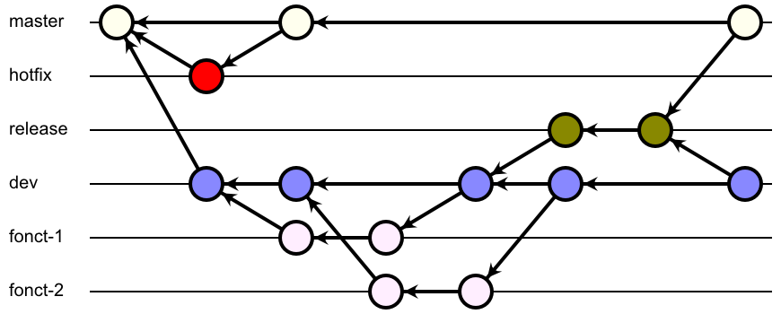

# didacticiel-gitflow

Un didacticiel (ou tutoriel) expliquant le GitFlow.

# GitFlow

Le GitFlow est une architecture permettant de séparer le projet en branches distinctes, chaque branche possédant une utilité propre.

# Les branches

## Plan des branches

Dans le diagramme ci-dessus, les branches sont dessinées sur des lignes, chaque commit étant un rond.

## Lecture du plan

- Le plan commence en haut à gauche, sur la branche `master`.
- La branche `dev` est issue de `master` dès le début du projet.
- Différentes branches de fonctionnalités, ici `fonct-1` et `fonct-2`, sont issue de `dev`, dévelopées séparément et fusionnées avec `dev` lorsqu'elles sont terminées. La branche `dev` n'est jamais éditée directement, seulement par fusion.
- Lorsqu'un jalon est atteint (souvent à cause d'une date butoir), une branche `release` est issue de `dev` dans son état actuel. Comme `dev` ne contient que des fonctionnalités qui ont terminé d'être développées, tout est prêt à partir en production.
  - Dans l'exemple ci-dessus, `dev` prend en compte la branche `fonct-1` lorsque la branche `release` est créée, mais pas `fonct-2`, qui n'a pas encore été développée en totalité.
- Après quelques évenutelles modifications de la branche `release`, lorsque la version du projet est validée, elle est fusionnée d'une part avec `master`, afin de pouvoir distribuer le produit, et d'autre part avec `dev` pour pouvoir continuer le développement en vue d'une prochaine version.
  - La branche `fonct-2`, par exemple, fait partie de `dev` après la distribution du produit. Elle sera incluse dans la prochaine version.
- La branche `hotfix` permet de modifier des bugs de grande importance qu'on aurait remarqué dans la version définitive. C'est la seule branche (à part pour `dev` au début du projet) qui est issue de `master`. Elle est à nouveau fusionnée avec `master` dès que la correction a été faite.

# Description détaillée des branches

## master

La branche `master` est la branche principale. Cependant, c'est la moins utilisée de toutes : elle ne contient que les versions publiques. Un utilisateur n'ayant accès qu'à la branche `master` ne verra donc que les versions successives du logiciel en mode production, en aucun cas les versions de travail.

## dev

La branche `dev`, issue de la version de base de la branche `master`, est la version de travail. Tout ce qui se trouve dessus est terminé, il n'y a aucune modification en travail. C'est autour de cette branche que les développeurs travailleront le plus souvent, sans pour autant la modifier réellement.

## branches de travail

De la branche `dev` ou d'une branche de travail déjà existante, chaque développeur peut créer une branche de travail portant le nom de l'amélioration qu'il développe. Il est important de toujours garder à l'esprit qu'une branche concerne une amélioration.

Dans une branche d'amélioration, le travail peut être sauvegardé en cours de route, les commits de ces branches ne sont pas forcément sans erreurs.

## release

Lorsqu'une version de la branche `dev` semble bonne à passer en production, on crée un embranchement de `dev` appelé `release`. Quelques modifications peuvent encore avoir lieu afin de corriger les derniers problèmes et de gérer les différents aspects propres aux releases. Une fois que la branche est validée, elle peut être fusionnée avec la branche `master` et avec la branche `dev`. C'est la seule manière de modifier la branche `master`.

## hotfix

La branche `hotfix` est créée lorsqu'une erreur grossière et gênante est détectée dans une version en production. Cette branche est issue de `master` directement et retourne dans `master` dès que la correction a été faite.
